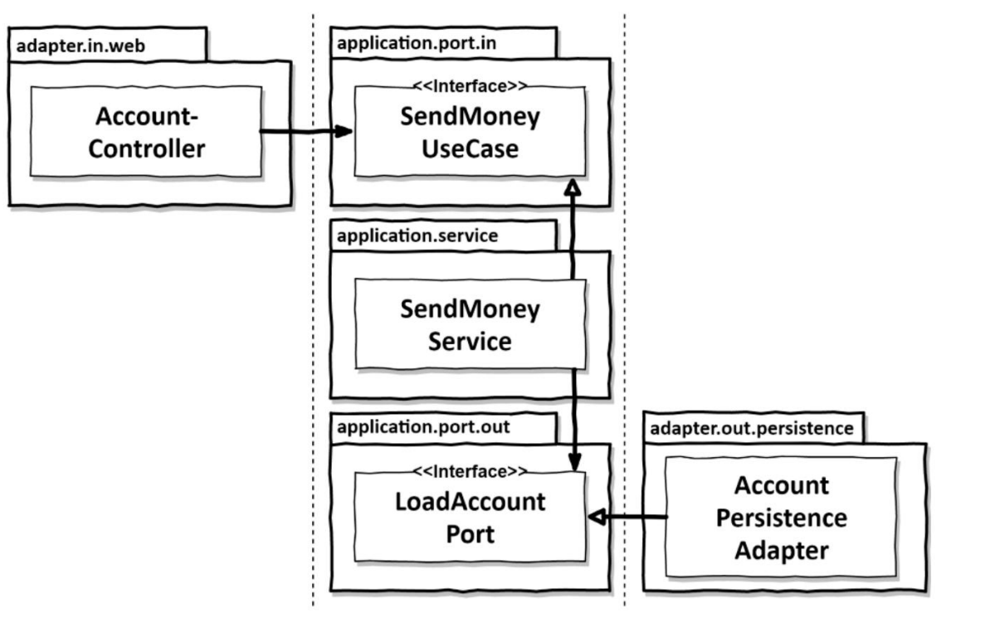

# GetYourHandsDirtyOnCleanArchitecture-

Documentando o processo e utilizando a arquitetura limpa

## Esté guia tem como objetivo documentar passo a passo de como criar e construir uma aplicação usando a arquitetura limpa.

### Qual é o objetivo de se utlizar Clean Architecture?

O objetivo maior é desaclopar o codigo do framework, pois isso deixa mais flexivel a mudanças caso tenha que trocar de
ferrametna de desenvolvimento, sem afetar a regra de negocio.

### O que é Clean Architecture?

A Clean Architecture é um padrão de arquitetura de software que visa criar sistemas que sejam independentes de
frameworks, bancos de dados, interfaces de usuário e outras partes externas. O objetivo é criar um código que seja fácil
de entender, manter e testar.

### Estrutura do projeto

Vamos utilizar um guia, e esse guia é apartir do livro "Get Your Hands Dirty on Clean Architecture" de Tom Hombergs.
O projeto será dividido em commits, onde cada commit será uma etapa de desenvolvimento.

Irei documentar cada etapa para compreender e analisar se realmente estou entendendo o que estou fazendo.

## Primeiros passos criando a account

Primeira estrutura criar um pacote pai, onde ele fala sobre account, dentro dele usaremos a arquitetura hexagonal, onde
temos 3 sub pastas

- domain (Modelo da regra de negocio e entidade)
- application ( caso de uso com o service)
- adapter ( interface de entrada e saida, onde temos o controller )

Importante resaltar sobre esse processo, A estrutura do pacote descrita acima contribui muito para uma arquitetura
limpa, mas um requisito essenecial de tal arquitetura é que a camada de aplicação não tenha dependências dos adaptadores
de entreada e saída

O controlador web chama uma porta de entrada, que é implementada por um serviço. O serviço chama uma porta de saída,
que é implementada por um adaptador.

### CASO DE USO

1. Receba inforamções
2. Valide as regras de negócios
3. Manipular o estado do modelo
4. Retornar a saída

